# Sale Target Tracker

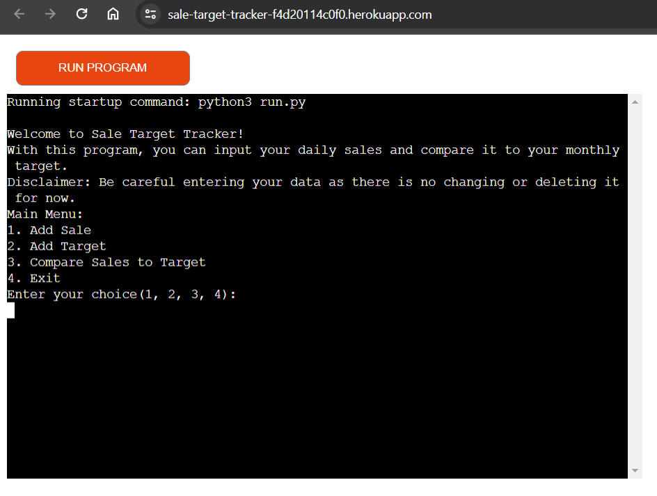

Sale Target Tracker allows the user to compare their daily sales to the target of the month that they have been given.

After inputting the correct values, the program will inform the user whether they have reached the target or not.

Visit the deployed application [here](https://sale-target-tracker-f4d20114c0f0.herokuapp.com/)

## Table of Contents
1. [User Experience (UX)](#user-experience-UX)
    1. [Project Goals](#project-goals)
    2. [User Stories](#user-stories)
    3. [Data Model](#data-model)
    4. [Flowchart](#flowchart)
2. [Features](#features)
    1. [Welcome Message](#welcome-message)
    2. [Main Menu](#main-menu)
    3. [Add Sale](#add-sale)
    4. [Add Target](#add-target)
    5. [Compare Sale to Target](#compare-sale-target)
    6. [Exit Program](#exit-program)
    7. [CSV File](#csv-file)
3. [ Technologies Used](#technologies-used)
    1. [Language Used](#language-used)
    2. [Frameworks, Libraries and Programs Used](#frameworks-libraries-programs-used)
4. [Testing](#testing)
    1. [Testing User Stories](#testing-user-stories)
    2. [Code Validation](#code-validation)
    3. [Manual Testing](#manual-testing)
5. [Deployment](#deployment)
6. [Credits](#credits)
7. [Acknowledgements](#acknowledgements)

***

## User Experience (UX)

### Project Goals

* Display information about what the program does and any features that may not be available at the moment.

* Provide clear options to the user to avoid confusion.

* Provide clear instructions and error messages that instructs user on how to correctly input data.

* Allows the user to exit the program if they wish, otherwise it will continue running.

* Prints a CSV file for the user to read the data they have inputted.

### User Stories

* As a user, I want to know exactly what the program can do.

* As a user, I want to be able to clearly understand the options being given.

* As a user, I want to be able to easily choose options with each step.

* As a user, I want to be able to read the directions clearly so that I may input data correctly.

* As a user, I want to be informed when I have inputted data incorrectly.

* As a user, I want to be able to input data as much as I want and leave the program when I am finished.

* As a user, I want to be able to view the data I inputted after exiting the program.

### Data Model

Simple options between 1 through 4 to navigate through the main menu.

An easy text and number input request for both sale and target with clear instructions on how to input, with inputs being stored on a CSV file.

After entering sale and target data, the program calculates between the sale value of the day and the target of the month. Which is also stored in the same CSV file.

Data stored in the CSV file is displayed to the user at the end for reviewing.

### Flowchart

The following flowchart was designed using [Lucid Chart](https://lucidchart.com/) to map out the program.

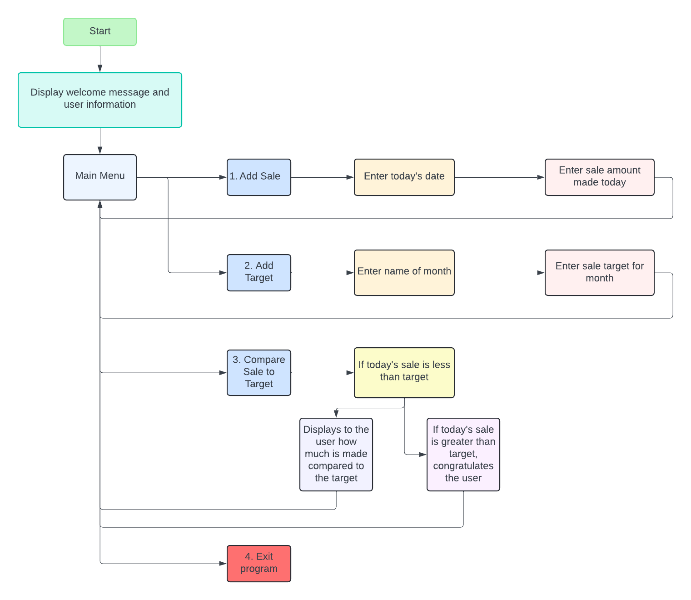

[Back to the top ⇧](#table-of-contents)

## Features

### Welcome Message

Displays a welcome message to the user, along with what the program does and a disclaimer.

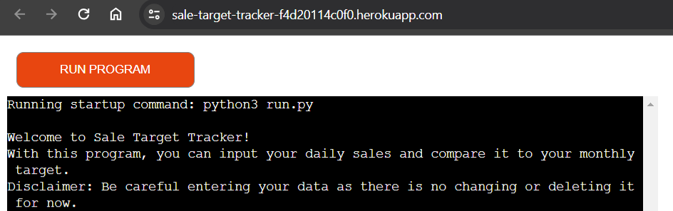

### Main Menu

Displays a menu with four clearly described options to be chosen from.

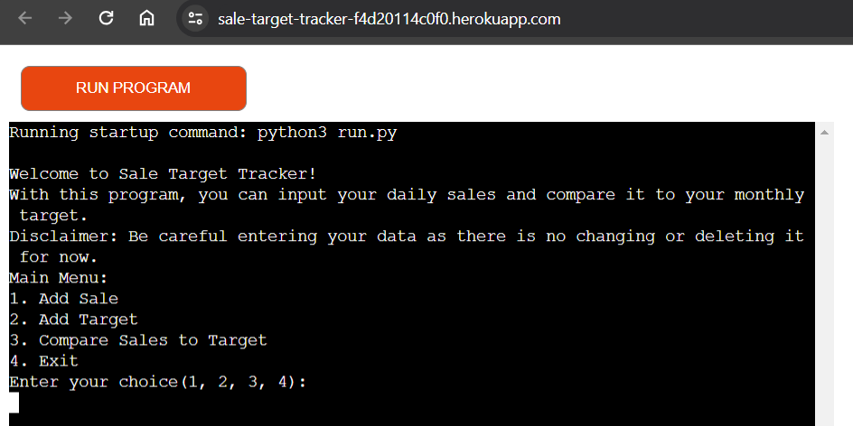

### Add Sale

Choice #1 allows the user to add the date and the sale amount of that date and returns the input.

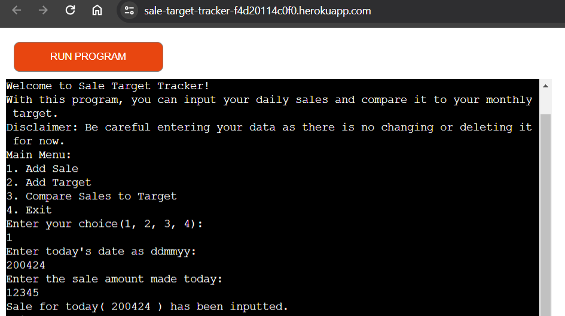

When input is incorrect, user is informed and instructed.

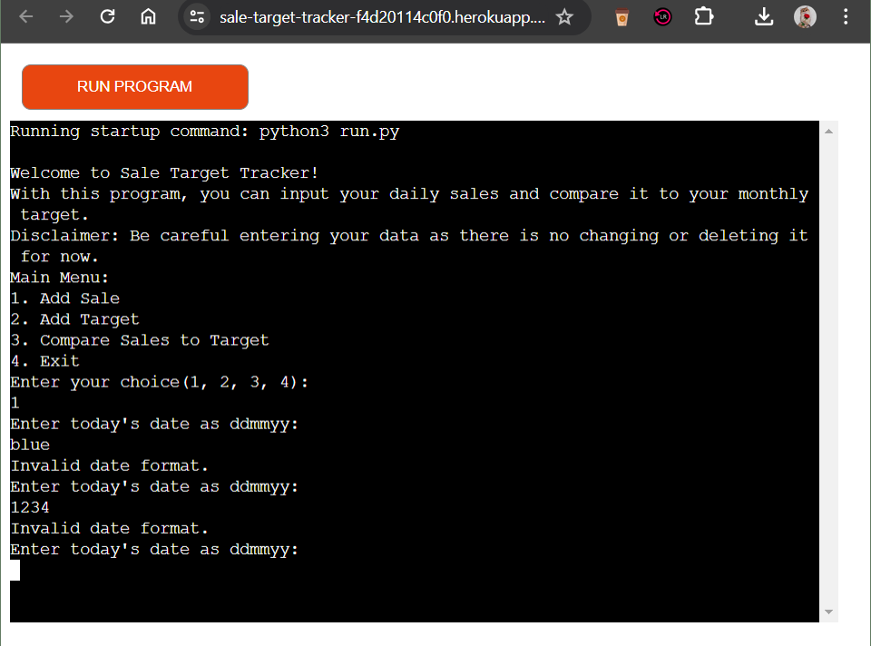

### Add Target

Choice #2 allows the user to add the name of the month along with the target for the month and returns the input.

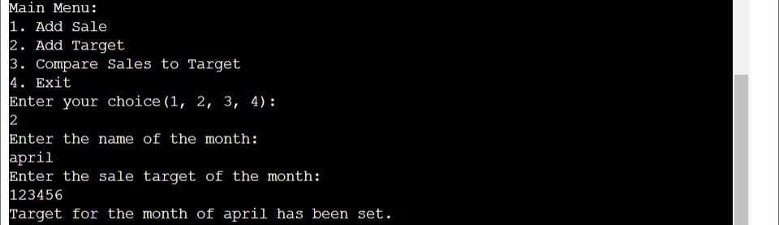

When input is incorrect, user is informed and instructed.

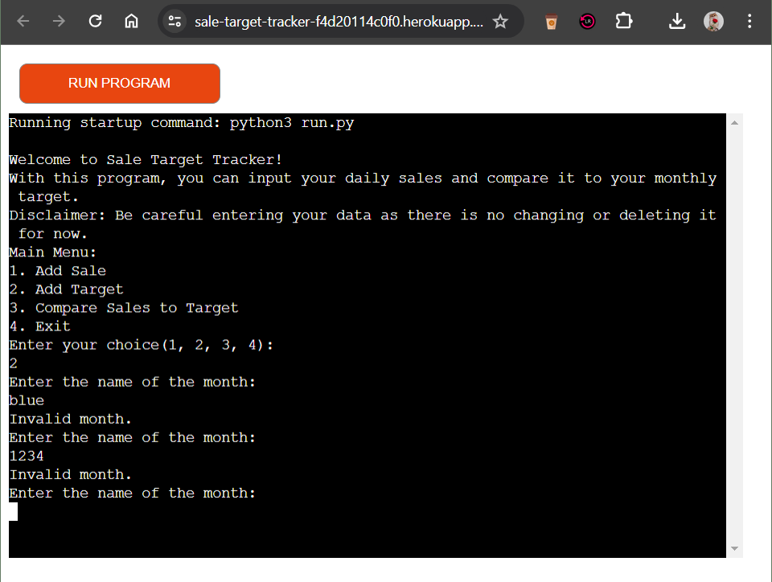

### Compare Sale to Target

Choice #3 compares the data from user input and displays two different options to the user.

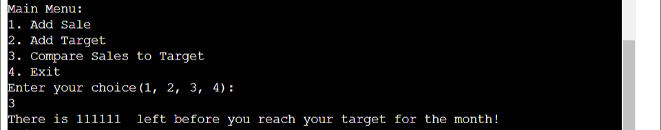

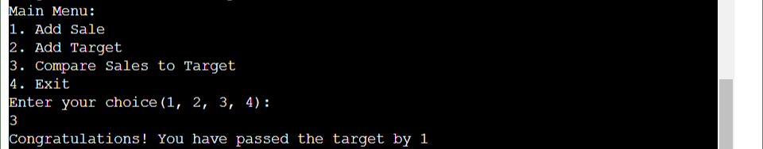

When choice #3 is chosen before inputting a sale and target, an error displays to the user and instructs them to add sale and target first.

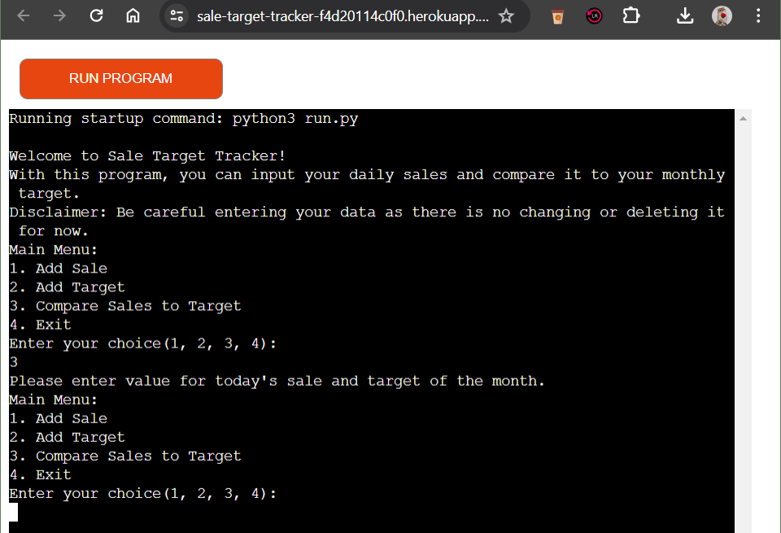

### Exit Program

Choice #4 allows the user to exit out of the program which concludes the loop.

### CSV File

After the user exits the program, the CSV file of what was inputted will open for the user to review.

[Back to the top ⇧](#table-of-contents)

## Technologies Used

### Language Used

* [Python3](https://en.wikipedia.org/wiki/Python_(programming_language))

### Frameworks, Libraries and Programs Used

* [GitPod](https://gitpod.io/) was used to write, edit, commit and push the code to GitHub.

* [GitHub](https://github.com/) is where the project is pushed to, storing all it's data.

* [Heroku](https://id.heroku.com) deployed the application.

* [CI Python Linter](https://pep8ci.herokuapp.com/#) was used to validate the code written in Python.

* [Lucid Chart](https://lucidchart.com/) was used to make the flowchart to map out the program.

[Back to the top ⇧](#table-of-contents)

## Testing

### Testing User Stories

* As a user, I want to know exactly what the program can do.

    - At the beginnig of the program, there is a welcome message.

    - An explanation on what the program does is provided.

    - A disclaimer on what the program cannot do yet is also provided.

* As a user, I want to be able to clearly understand the options being given.

    - Under the welcome message is the main menu displayed.

    - There are 4 options given, describing exactly what they do.

* As a user, I want to be able to easily choose options with each step.

    - Each option is numbered.

    - If input is incorrectly entered, the user is informed and instructed on how to correctly input.

* As a user, I want to be able to read the directions clearly so that I may input data correctly.

    - Before entering data, there is instructions on what should be inputted and whether there is a format to be followed.

    - If an error occurs when inputting, the user is informed and given correct format/clear information on what should be entered as data.

* As a user, I want to be informed when I have inputted data incorrectly.

    - All inputs required have code validation.

    - Program will loop after every error until correctly done.

* As a user, I want to be able to input data as much as I want and leave the program when I am finished.

    - After inputting sale amount/target data, it is possible to input more as the program loops back to the main menu after sale amount/target is inputted.

    - Option #4 allows the user to leave the program completely.

* As a user, I want to be able to view the data I inputted after exiting the program.

    - Once the user exits the program, a CSV file will open with the date inputted.
